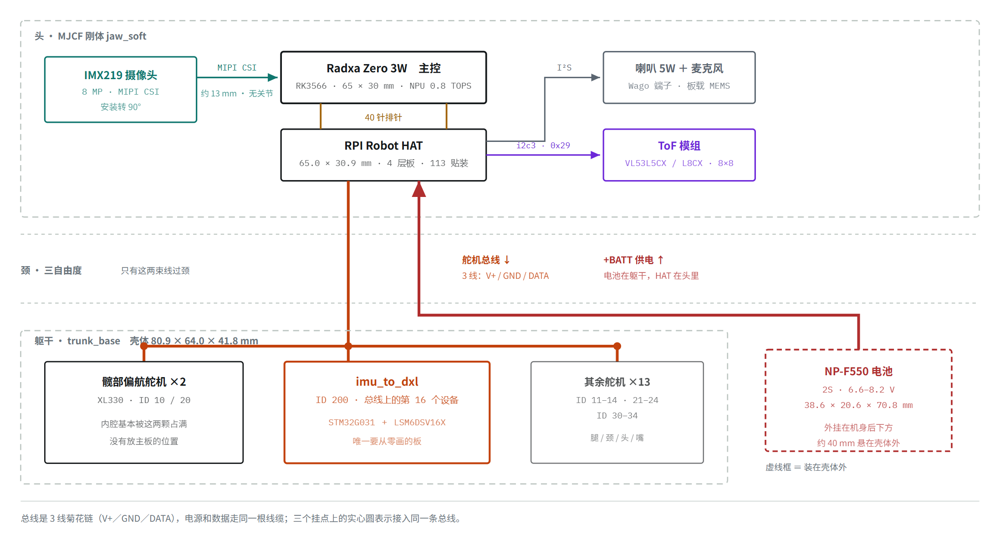

# Microduck Replica

**English** · [简体中文](README.md)

> A third-party reconstruction study of [Pollen Robotics' Microduck](https://pollen-robotics.com/microduck/).
> Assembly drawings, exploded views, CAD-importable assemblies, and a complete
> electronics teardown — all derived from publicly released files and source code.

Microduck is a 25 cm, 737 g bipedal robot duck driven by 15 Dynamixel XL330 servos
(14 under policy control) that learns to walk with reinforcement learning.

Its **software is open source (Apache-2.0)**. Its hardware is **partly** open:

- ✅ **The RPI Robot HAT board is fully published** — [`pollen-robotics/elec_RPI_Robot_HAT`](https://github.com/pollen-robotics/elec_RPI_Robot_HAT)
  (Apache-2.0): KiCad 9 project, Gerbers, BOM, pick-and-place and STEP. **You do not need to redraw this board.**
- ❌ **The `imu_to_dxl` board is not published** — no public project exists anywhere; the reconstruction
  in this repo is the only one available.
- ❌ **No editable mechanical CAD**, no whole-robot BOM, no assembly documentation. Pollen Robotics
  [told the press not to call it "open-source hardware" (for now)](docs/社区动态.md).

> 📌 **Correction (2026-09-03)**: this document previously stated "its hardware is not [open], no PCB
> schematics". **That was wrong** — it searched only `pollen-robotics/microduck` and missed the
> organisation's `elec_`-prefixed hardware repositories.

But two public artifacts turn out to be enough:

1. **`microduck_rl` ships the full MJCF model and 47 STL meshes.** The MJCF contains the
   complete kinematic tree — which part mounts to which, relative positions accurate to
   0.1 mm, joint axes, travel limits, masses and inertia tensors.
2. **The Rust runtime is open source, and a runtime that drives real hardware must
   hard-code device paths, I²C addresses, register offsets, baud rates and protocols.**
   The code *is* the datasheet.

This repository is what falls out of reading both.

> ✅ **Independently verified.** On 2026-08-31, [@tspy](https://x.com/tspy/status/2094249218735300630)
> published a hardware teardown on X (169 likes) that matches this repository's
> conclusions exactly — including the critical one: **the main board is a Radxa Zero 3W**.
> Two independent paths, one answer. See [Community Intelligence](docs/社区动态.md).

---

## Two tracks — pick one

This repository covers two servo choices. **Mechanics, electronics and software all differ**, so decide before building:

| | Original · Dynamixel XL330 | Feetech · HD-1910 |
|---|---|---|
| **Servos** | XL330-M288-T ×15 | HD-1910-C001 ×15 — half the price, 2.5× the torque |
| **Voltage** | rated 6 V, run at 6.6–8.2 V, **37% over** | rated 4–8.4 V, within spec; a full pack sits at the 8.4 V ceiling |
| **Printed parts** | [`print/`](print/) upstream STLs as-is | **8 mating parts remodelled** (HD-1910 horn protrudes, XL330's is recessed) — [MakerWorld](https://makerworld.com.cn/zh/models/2963569-microduck#profileId-3478428) / [3mf](https://github.com/fanhao375/microduck-replica-cad/tree/master/打印) |
| **Editable CAD** | [CAD repo v1.1](https://github.com/fanhao375/microduck-replica-cad/releases/tag/v1.1) | [CAD repo v2.0](https://github.com/fanhao375/microduck-replica-cad/releases/tag/v2.0), files carry an `-FT` suffix |
| **Electronics** | official HAT + [`imu_to_dxl`](hardware/imu_to_dxl/) | same; servo connectors are 2.0 mm (official 2.5), `imu_to_dxl` has J4/J5 at 2.0 |
| **Software** | official runtime runs as-is | different bus protocol, swap the protocol module — [adaptation architecture](software/飞特适配架构.md) (zh); policy retrained for HD-1910 — [training data checklist](docs/HD-1910训练前数据清单.md) |
| **Status** | paper analysis + first prints | **full robot assembled** (2026-09-13), **all 15 servos on the bus, stands up and sits down** (2026-09-18); zero pose and stance still being tuned |

The selection argument is in [Actuator Selection](docs/actuator-selection.en.md). This repo's main line is Feetech; the original track is documented just as fully.

---

## Community

A WeChat group for people working on the same thing — build progress, pitfalls, sourcing.

The code below is for **Duck Replica Group 9** (WeChat disables QR joins once a group reaches 200 members).

<div align="center">
  
  <br>
  <sub><b>Duck Replica Group 9 · expires 2026-10-01</b> — WeChat group codes are valid for 7 days<br>
  If it has expired, open an <a href="https://github.com/fanhao375/microduck-replica/issues">issue</a> and I will post a fresh one</sub>
</div>

## Latest

<table>
<tr>
<td width="50%" valign="top">

### 🔌 Electronics · all 15 servos powered up in the assembled duck, and it stands (2026-09-18)

<p align="center"><a href="assets/首次上电-2026-09-18.mp4"></a></p>

First time the assembled duck was on the bus: URT-2 over USB, 7.4 V into V1, **all 15 HD-1910 online, 0 timeouts, 0 checksum errors**, one sync_read of 15 servos in 4.8 ms.
Driven from the new [web servo console](tools/servo-web/) in this repo: sliders, saved poses, sequences, a 3D model that follows the real robot and a live centre-of-mass marker against the foot support.
Above, it stands up from the tucked pose **by itself**, then sits back down. **First step of the Feetech software path works**; the hardware plan holds.

The first `imu_to_dxl` boards arrived: 3.3 V rail fine, J4/J5 connector footprint needs a fix, firmware not written yet — [design notes and reviews](hardware/imu_to_dxl/).

**[Web servo console](tools/servo-web/)**　·　
**[Debug log](调试记录.md)** (zero pose, joint direction, stance pitfalls)　·　
[Pitfalls](踩坑记录.md#工具) (URT-2: USB first, then servo power)　·　
[Feetech adaptation architecture](software/飞特适配架构.md) (zh)

</td>
<td width="50%" valign="top">

### 🔨 Mechanical · Feetech HD-1910 build is assembled

<a href="BUILD-LOG.en.md"></a>

**All 15 Feetech HD-1910 servos configured and mounted.** Not the official XL330 — half the
price, 2.5× the torque, running inside its rated voltage; the path argued in
[Actuator Selection](docs/actuator-selection.en.md), now physical.

**The HD-1910 horn protrudes where the XL330's is recessed**, so the 8 parts that mate with
horns were remodelled and reprinted. The editable SolidWorks drawings have an FT variant
(`-FT` suffix) with what changed and why.

**[Build Log](BUILD-LOG.en.md)**　·
**[Feetech-variant SolidWorks drawings](https://github.com/fanhao375/microduck-replica-cad)**　·
**[Print on MakerWorld (Feetech build)](https://makerworld.com.cn/zh/models/2963569-microduck#profileId-3478428)**　·
[Debug Log](调试记录.md)　·
**[BOM with purchase links](https://github.com/fanhao375/microduck-replica-cad#装配-bom)**　·
[Printable parts](print/)
</td>
</tr>
<tr>
<td width="50%" valign="top">

### 💻 Software · web console driving 15 servos over the serial bus

<p align="center"><a href="tools/servo-web/"></a></p>

Drag a slider in the browser and the servo moves; the 3D duck follows, and the centre-of-mass
projection shows live whether it still falls inside the foot support polygon. Save poses, run
sequences, calibrate the zero in one click, dump every register, measure bus timing — this is the
tool used for assembly and bench acceptance.

The backend does not use the Feetech SDK: [`feetech.py`](tools/servo-web/feetech.py) speaks the
2026 protocol manual directly in about a hundred lines. It ships with a **packet-level servo
simulator**, so calibration, ID changes and register writes are self-tested with no hardware attached.

`FeetechIo` for the official runtime (the `RobotIo` seam, rustypot protocol v1) is written and
waiting on the zero calibration before it goes on the board.

**[Web console](tools/servo-web/)**　·　
**[Feetech port architecture](software/飞特适配架构.md)**　(Chinese)　·　
[Feetech official docs](docs/飞特资料/)

</td>
<td width="50%" valign="top">

### 🧠 Algorithms · public 1910 M6 parameter integration

The Feetech simulation baseline adopts the **1910 BAM M6 actuator parameters published by
[LuwuDynamics/xgoduck_rl](https://github.com/LuwuDynamics/xgoduck_rl)**. Thank you to LuwuDynamics
for sharing them. These parameters were not independently identified by this replica project.
The [provenance record](docs/HD-1910-M6参数来源.md) includes the pinned source revision,
original-file checksum and Apache-2.0 license.

The complete training project is included in **[`software/training/`](software/training/)**:
one clone includes the source, actuator parameters and simulation models. See the
[run guide and controller initialization fix](software/training/docs/hd1910-baseline.md).
Training builds on [Pollen Robotics/microduck_rl](https://github.com/pollen-robotics/microduck_rl)
and [Rhoban/BAM](https://github.com/Rhoban/bam). Integration tests and a short training check
have passed; there is no walking policy validated on this replica yet. Hardware testing still
needs joint calibration, IMU/runtime integration, and checks of actual mass/inertia and servo response.

**[HD-1910 pre-training data checklist](docs/HD-1910训练前数据清单.md)**　·　
[Actuator selection](docs/执行器选型.md)

</td>
</tr>
</table>

---

## 🔨 Build Progress

> This repository states repeatedly that simulation STLs are not manufacturing files.
> **The build log is the test of that claim.** The result gets recorded either way.

**→ [Build Log](BUILD-LOG.en.md)**

---

## 🦆 Contributions from the flock

This repo is not one person's work. Merged code and bench-verified findings are credited here.

| Who | What they contributed |
|---|---|
| [@yoyojacky](https://github.com/yoyojacky) | **A Rust test tool for Feetech servos** ([PR #27](https://github.com/fanhao375/microduck-replica/pull/27), merged). A minimal STS/SCS protocol implementation of his own (framing, checksum, ping, register read/write, status parsing). The CLI scans the bus with a progress bar, reads status, moves a servo to a position, and runs single or batch tests that report position error, peak current, peak load, voltage and temperature, with a PASS/FAIL verdict — one command gives you a bench acceptance table → [`tools/sts3215Servo_testtool/`](tools/sts3215Servo_testtool/) |
| [@Abo1ish](https://github.com/Abo1ish) | **IMU board firmware + attitude view in the debug console** ([PR #32](https://github.com/fanhao375/microduck-replica/pull/32), merged). A base STM32G031 firmware for the imu_to_dxl board that Pollen never open-sourced, verified on real hardware, with host-side tests and a [`VALIDATION.md`](hardware/imu_to_dxl/firmware/VALIDATION.md) that is clear about its limits → [`hardware/imu_to_dxl/firmware/`](hardware/imu_to_dxl/firmware/). He also streams the IMU attitude over J-Link into the web debug console, so the 3D duck's body turns with the real board (`--imu-jlink`, or `--imu-demo` with no hardware) → [`tools/servo-web/`](tools/servo-web/) |
| A member of the WeChat group | **Boot recipe for the Radxa Zero 3W V1.12J.** On this batch (WiFi changed to AIC8800DS2), swapping in Radxa's bootloader is not enough. He found by testing that the device tree has to come from Radxa too: **B1 bootloader + B1 DTB + Armbian 6.1.115 kernel + Trixie userland**, and got it booting → written up in the [pitfalls log](踩坑记录.md#软件) and the [image guide](tools/radxa/镜像使用说明.md) (both Chinese) |

### Projects from the flock

Some people build duck-related things in their own repos. The good ones get a shout-out here:

| Project | Author | What it does |
|---|---|---|
| [microduck-color-studio](https://github.com/LathamZ/microduck-color-studio) ([live demo](https://lathamz.github.io/microduck-color-studio/)) | [@LathamZ](https://github.com/LathamZ) | **A 3D color studio for the duck: settle the colors in your browser before you print.** Color each of the 70 parts, pick a material (PLA / matte / PETG / metallic / carbon fiber / TPU) and lighting to preview. Enter the filaments you already own and it recommends palettes from your stock (use what you have / add one color / acrylic accents). You can also import your own 3MF (e.g. the Feetech version) and export a **colored multi-plate 3MF** plus per-part STLs, with presets for Bambu P1S / A1 mini / H2D. Chinese and English UI, works on mobile |
| [MICDUCK_FTHD1901_REBUILD](https://github.com/fengj4780-sudo/MICDUCK_FTHD1901_REBUILD) | [@fengj4780-sudo](https://github.com/fengj4780-sudo) | **Feetech-build structural rework with optional CNC reinforcement.** Builds on our [editable SolidWorks drawings](https://github.com/fanhao375/microduck-replica-cad): adapted to the Feetech servo (written as HD1901 in that repo; the part files are HD-1910-C001), weak parts reinforced, assembly interferences fixed and some broken models repaired. **Five leg parts can be made as CNC parts** for better load paths (still being prototyped; the author estimates about ¥45 for all five including shipping); printing them instead also works and is stronger than the original. Includes a one-click 3MF (Bambu H2D, 0.4 mm, 5 plates) and the reworked SolidWorks drawings (Chinese) |

Built something for the duck (a tool, tutorial, mod, policy…)? Open an issue with the link and we'll add it.

Want to join in: open an [issue](https://github.com/fanhao375/microduck-replica/issues) or send a PR.
Hardware, firmware, algorithms, documentation, measured data — all of it counts. **Measured data especially**: the rule in this repo is that results get recorded honestly, positive or negative.

---

## Exploded Assembly View


Seven drawings under `assembly-drawings/`:

| File | Contents |
|---|---|
| `01_正面` `02_侧面` `03_背面` `04_四分之三` | Front / side / rear / isometric, assembled, natural colors |
| **`05_爆炸图_侧面`** | 15 parts exploded along the kinematic chain, labeled with names and masses |
| **`06_爆炸图_四分之三`** | Isometric — shows the left/right leg mirroring clearly |
| `07_分色对照_装配态` | Assembled state in the same color coding, for cross-reference |

## Assembly Structure

```
Trunk 199 g
├─ L hip yaw→roll 23 g → L hip roll 6 g → L thigh 48 g → L shin 22 g → L ankle+foot 30 g
├─ Neck base 37 g → Neck pitch 6 g → Head yaw/roll 49 g → Head assembly + beak 189 g
└─ R hip yaw→roll 23 g → R hip roll 6 g → R thigh 48 g → R shin 22 g → R ankle+foot 30 g

Total 737.2 g   Envelope 144 × 141 × 264 mm
```

The trunk and the head weigh almost the same (199 g vs 189 g) — **the head is a quarter of
the whole robot and the center of mass sits high**, which explains why its walking policy
is hard to train.

## Joint Parameters

Five DoF per leg, four for neck and head — **14 under policy control**.
The robot actually carries **15 Dynamixel XL330**: the 15th drives the beak through a
passive linkage and never enters the action space.

| Joint | Travel |
|---|---|
| `hip_yaw` | −25° … +30° |
| `hip_roll` | ±22° |
| `hip_pitch` / `knee` / `ankle` / `head_pitch` | ±90° |
| `neck_pitch` | −90° … +60° |
| `head_yaw` | ±170° |
| `head_roll` | ±25° |

## 📋 Bill of Materials

**What to buy and how many** — [`BOM.en.md`](BOM.en.md)

15 servos, 14 bearings, ~325 fasteners, 2 boards to fabricate. Quantities are counted from geom
references in the upstream MJCF (38 mesh types / 75 instances), not estimated. Includes a per-board
parts list with LCSC numbers.

> ⚠️ Two corrections in there that stop you buying the wrong thing: **the battery is an NP-F550,
> not an F970**, and **the XL330 is run over-voltage**.

## 3D-Printable Parts

Every individual STL, split into print-these and buy-these, bilingual filenames — [`print/`](print/)

| Directory | Count |
|---|---|
| [`print/打印件/`](print/打印件/) | **30 types / 41 pieces** of structural parts |
| [`print/标准件-无需打印/`](print/标准件-无需打印/) | **9** bought-part models (for fit checking) |

> Upstream's 7 test-bench fixtures and 1 duplicate are excluded. Printing notes:
> [`print/README.en.md`](print/README.en.md).

## CAD Assemblies

`cad/` holds STL files **with world transforms already applied** — import them and the
robot is assembled. (The 47 upstream STLs are each in their own part coordinate frame;
importing those directly piles every part at the origin.)

- `00_Microduck_整机装配体.stl` — whole robot, single file, 796,792 triangles
- `01` … `15` — the 15 rigid bodies, filenames are part names
- `零件对照表.json` — which upstream source meshes make up each body

Units are **millimeters**. Opens in FreeCAD, Fusion 360, SolidWorks, Blender, or any slicer.
No CAD installed? `tools/stl_viewer.html` is a zero-install WebGL viewer — open it in a
browser and drop an STL in.

### 📐 Want editable parametric models? Different repo

Everything under `cad/` and `print/` here is **mesh** (STL) — printable, viewable,
measurable, but **not editable**.

**[fanhao375/microduck-replica-cad](https://github.com/fanhao375/microduck-replica-cad)**
is the companion repo holding **editable SolidWorks source files**: 16 assemblies +
40 parts, plus a **21-page assembly manual** with per-component steps, figures and cautions.

> Those drawings were modelled — and the manual written — by
> **[机械行者Robo](https://github.com/fanhao375/microduck-replica-cad#图纸作者机械行者Robo)**.
> Go there if you want to change dimensions, wall thickness, or generate your own drawings.

---

## Electronics, Reverse-Engineered from the Runtime

<div align="center">
  
  <br>
  <sub><b>Physical layout of the five modules.</b> Dashed grey = physical region, solid = module,
  dashed red = mounted <b>outside</b> the shell.<br>
  <b>Orange</b> is the servo bus (top-down), <b>red</b> is battery power (bottom-up).<br>
  The one thing people get wrong: <b>the compute board, the HAT and the camera are all in the head</b> —
  the camera sits ~13 mm from the board centre with no joint between them,<br>
  so the MIPI ribbon never crosses the neck. What does cross it is the servo bus and the power line.<br>
  <a href="docs/硬件入门.md">Full diagram set (Chinese) →</a>　·　<a href="assets/hw/Microduck硬件图集.pdf">Download PDF (7 diagrams, A3)</a></sub>
</div>


**One 1 Mbps TTL serial bus does everything.**

```
                Radxa Zero 3W (RK3566) · Armbian
                  ├── UART2  1 Mbps TTL half-duplex ── 15× XL330 + imu_to_dxl (ID 200)
                  ├── I2C3   400 kHz (pins 3/5) ────── AIC3104@0x18 · ToF@0x29 · BMI088 (unused)
                  ├── I2S3   12.288 MHz ────────────── audio
                  ├── MIPI CSI ─────────────────────── IMX219 (I2C@0x10, mounted upside down)
                  ├── Bluetooth ────────────────────── gamepad / phone app
                  ├── Wi-Fi ────────────────────────── WebRTC
                  └── USB-C ────────────────────────── power + maskrom
```

| | |
|---|---|
| **Main board** | **Radxa Zero 3W** — an off-the-shelf module, *not* a custom carrier |
| SoC | RK3566, quad Cortex-A55, Mali-G52, 0.8 TOPS NPU, 1 GB RAM / 32 GB eMMC |
| **Servo bus** | **Single-wire half-duplex TTL** — *not* RS-232, *not* RS-485. Dynamixel Protocol V2 @ 1 Mbps on `/dev/ttyS2` |
| **Custom board 1** | **`imu_to_dxl` v2** — an LSM6DSV16X that speaks Dynamixel: bus ID 200, register 124, a 12-byte block read in the *same* `sync_read` as the servos |
| **Custom board 2** | **RPI Robot HAT** — TLV320AIC3104 @ 0x18, a dormant BMI088, a Stemma header for the ToF. **Published by Pollen** ([`elec_RPI_Robot_HAT`](https://github.com/pollen-robotics/elec_RPI_Robot_HAT)) |
| Battery | Sony NP-F550, 2S Li-ion. **No fuel gauge, no ADC** — pack voltage is read from what the servos report as their own supply |
| Sensors | LSM6DSV16X IMU · VL53L5CX/L8CX 8×8 ToF · IMX219 (Pi Camera v2) |

The `imu_to_dxl` design is the elegant part: the IMU is not on I²C. It presents itself as a
Dynamixel slave, so orientation arrives in the same bus transaction as the joint states —
no second bus, no host-side sensor fusion (the LSM6DSV16X's on-chip SFLP block emits a game
rotation quaternion and estimates its own gyro bias).

**Full detail:** [Hardware Teardown](docs/hardware-teardown.en.md) (English) ·
[Spec Sheet](docs/硬件规格速查.md) (Chinese)

---

## Can You Actually Build One?

| | Status |
|---|---|
| Part geometry | ✅ 47 STLs |
| Assembly relationships | ✅ 0.1 mm accurate, drawings produced |
| Joint axes / travel | ✅ all 14 |
| Mass / inertia | ✅ all 15 bodies |
| Servo model | ✅ Dynamixel XL330 × 15 |
| Bearings | ✅ Ø22×16×4 and Ø15×10×3 |
| Battery / sensors | ✅ NP-F550 2S, IMX219, VL53L8CX, LSM6DSV16X |
| Main board | ✅ **Radxa Zero 3W, off the shelf** |
| **HAT board** | ✅ **Officially published** — KiCad + Gerbers + BOM → [`elec_RPI_Robot_HAT`](https://github.com/pollen-robotics/elec_RPI_Robot_HAT) |
| **`imu_to_dxl` board** | ⚠️ Not published; must be redrawn. Protocol and register layout fully recovered |
| **Fastener list** | ✅ Reverse-engineered from hole features → M2 system |
| **Cable routing** | ❌ Nothing published |
| Control software | ⚠️ Rust runtime is Apache-2.0 and **runs as-is on the same main board** |

⚠️ **Simulation STLs are not manufacturing files.** Simulation only needs outer shape and
inertia — it guarantees nothing about fit tolerances, threads, heat-set insert bosses or
cable clearance. Printing these directly will most likely not assemble.

💰 **Building one probably costs more than buying one — but how much more depends entirely on
your channel.** Fifteen XL330s run about **$359** at ROBOTIS international, **$412** at ROBOTIS US,
and **€603–629** in Europe inc-VAT — anywhere from slightly under the robot's retail price to well
above it. Add the compute module, battery, two boards to fabricate and filament, and it is certainly
more. Full costing: [BOM.en.md](BOM.en.md).

**The conclusion has been revised** from "the mechanics are copyable, the electronics are a wall"
to **"the whole robot is reproducible"** — the main board is an off-the-shelf module, and the custom
boards' function and protocol have been fully recovered from source.
See [Hardware Teardown](docs/hardware-teardown.en.md).

---

## The Realistic Path

Skip 100% replication and go **"copy the mechanics, build your own electronics"**:

| | Approach |
|---|---|
| Mechanics | Use the STLs and drawings here — geometry copies exactly |
| Servos | XL330 × 15, off the shelf |
| Main board | **Radxa Zero 3W**, same as the original |
| IMU board | Roll your own `imu_to_dxl`: LSM6DSV16X + a small MCU + half-duplex transceiver. The protocol is fully documented here |
| HAT | **Order the official Gerbers** (4-layer); or skip it entirely if you don't need audio |
| Software | Same main board → the official Rust runtime runs unmodified |
| Policies | The nine shipped ONNX policies work; retrain with [microduck_rl](https://github.com/pollen-robotics/microduck_rl) if you change hardware |

## Three Pitfalls Worth Knowing

1. **Armbian runs a login console on UART2.** `serial-getty@ttyS2` holds the port —
   `systemctl mask` it. Pollen found this with `fuser -v /dev/ttyS2`.
2. **i2c3 collides with the FUSB302.** Using the hardware I²C on header pins 3/5 costs you
   USB-C PD negotiation (plain 5 V charging still works).
3. **The NPU ships disabled** in Armbian — flash the overlay and reboot to run RKNN models.

---

## Ecosystem Map

Microduck material is scattered across several GitHub orgs and three HuggingFace resource types —
**the official hardware repos are especially easy to miss**. [`docs/ecosystem.en.md`](docs/ecosystem.en.md)
annotates every official repo, simulator, policy, dataset and community project with what it is and
what it is good for.

## Documentation

| Document | Contents |
|---|---|
| [**Hardware Spec Sheet**](docs/硬件规格速查.md) | One-page reference — block diagram, part numbers, bus parameters, build list, pitfalls |
| [**Hardware Primer**](docs/硬件入门.md) | **Board by board** — what each of the five modules does, how one 20 ms control tick flows, what changes on the Feetech route, and a closing section on **five checks to run before you replicate** |
| [**Electronics Sourcing (CN)**](docs/电控采购清单.md) | Taobao links with verified availability — main board, camera, ToF, power, both PCBs, cabling and the debug adapter |
| [**Mechanical Sourcing (CN)**](docs/机械采购清单.md) | Bearings, M2 fasteners, heat-set inserts and the insertion tip, thread locker, filament |
| [**Hardware Teardown**](docs/hardware-teardown.en.md) 🇬🇧 | **Full derivation with evidence citations — the main board, both custom boards, bus protocol, sensors, power** |
| [**Actuator Selection**](docs/actuator-selection.en.md) 🇬🇧 | XL330 parameters, BAM M6 config, five calibrated PD sets, backlash modeling — plus **why closed-loop steppers do not work here, what swapping to a Feetech STS3215 actually costs** (737 g vs 2107 g, measured), and a **cross-comparison of same-class servos** including a deep assessment of the Unitree S288 |
| [**Fastener Reconstruction**](docs/fastener-reconstruction.en.md) 🇬🇧 | Hole-feature scan across 47 STLs → M2 system and purchase quantities |
| [Community Intelligence](docs/社区动态.md) | X / GitHub signals, independent verification, noise and scam warnings |
| [Progress](PROGRESS.md) | Status, decisions, open work |

> 🇬🇧 marks documents available in English. The rest are Chinese-only for now — their
> tables, part numbers, addresses and diagrams are readable without it, and machine
> translation handles the prose well.

## Reproducing This

```bash
# 1. Fetch upstream for the drawing scripts below (training is already in software/training/)
bash scripts/fetch_upstream.sh

# 2. Regenerate the drawings
python scripts/render_assembly.py upstream/microduck_rl assembly-drawings

# 3. Re-export the CAD assemblies
python scripts/export_assembly_stl.py upstream/microduck_rl cad

# 4. Re-scan hole features
python scripts/analyze_holes.py upstream/microduck_rl/src/mjlab_microduck/robot/microduck/assets
```

Requires `mujoco`, `numpy`, `pillow`, `scipy`. Rendering needs a working OpenGL context.

## License

- `scripts/` — Apache-2.0
- `assembly-drawings/`, `cad/` — **CC BY-SA-NC 4.0**. Upstream 3D models are CC BY-SA-NC;
  ShareAlike requires derivatives to carry the same license. **Non-commercial only.**

See [NOTICE.md](NOTICE.md). Not affiliated with or endorsed by Pollen Robotics.
