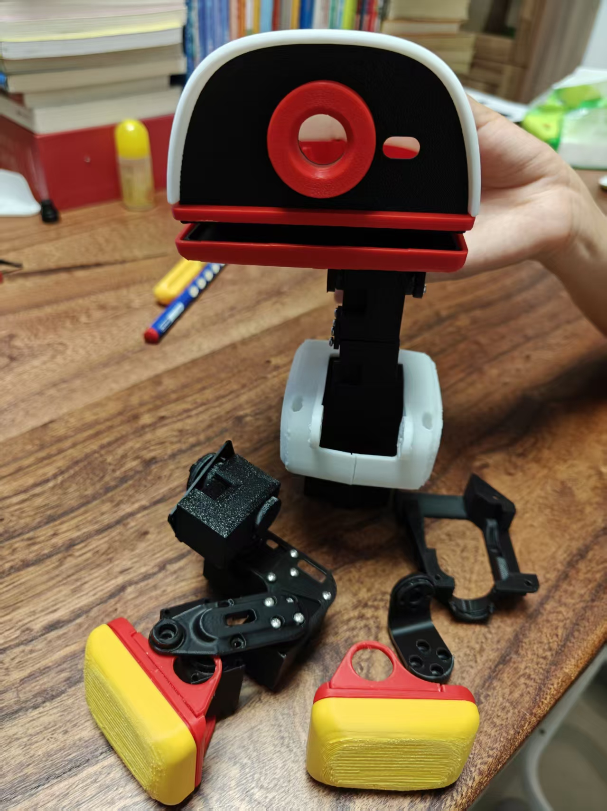
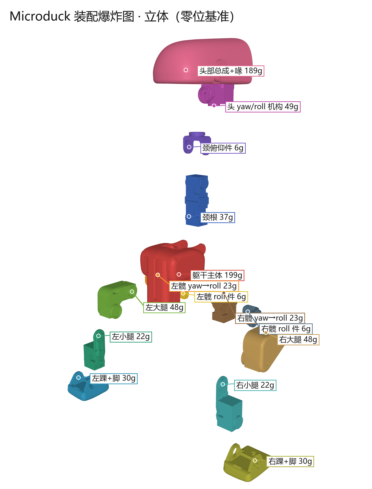

# Microduck 复刻

**简体中文** · [English](README.en.md)

> 对 [Pollen Robotics Microduck](https://pollen-robotics.com/microduck/) 的第三方复刻研究。
> 从官方公开的 MJCF 仿真模型反推出**装配图、爆炸图和可直接导入 CAD 的装配体**。

Microduck 是一只 25cm 高、737g 的双足机器鸭，15 个 Dynamixel XL330 舵机（14 个受策略控制），用强化学习走路。
它的**软件开源（Apache-2.0）**。硬件是**部分开源**：

- ✅ **RPI Robot HAT 板完整开源** —— 见 [`pollen-robotics/elec_RPI_Robot_HAT`](https://github.com/pollen-robotics/elec_RPI_Robot_HAT)（Apache-2.0）：
  KiCad 9 工程、Gerber、BOM、贴片坐标、STEP 一应俱全。这块板**不需要自己画**。
- ❌ **`imu_to_dxl` 板未开源** —— 全网无公开工程，本仓库的逆向是目前唯一公开重建。
- ❌ **机械件无可编辑 CAD**、无 BOM、无装配文档。

> 📌 **勘误（2026-09-03）**：本文档此前写作「硬件不开源、没有 PCB 原理图」，**这是错的**。
> 当时只检索了 `pollen-robotics/microduck` 主仓，未翻查该组织下以 `elec_` 开头的硬件仓库。

但官方在 `microduck_rl` 里发布了完整的 **MJCF 仿真模型 + 47 个 STL 网格**。
MJCF 里包含了完整的运动学树：每个零件挂在谁身上、相对位置精确到 0.1mm、
绕哪根轴转、行程多少、质量和惯量张量。

**这些信息足以还原出装配关系。** 本仓库就是把它还原出来的结果。

---

## 交流群

有人在做同样的事，凑了个微信群一起讨论复刻进度、踩过的坑、元件采购。

<div align="center">
  
  <br>
  <sub><b>二维码有效期到 2026-09-10</b>（微信群码 7 天自动失效）<br>
  过期了请开个 <a href="https://github.com/fanhao375/microduck-replica/issues">issue</a> 说一声，我会换上新的</sub>
</div>

## 🔨 实物进度

**有人正在把它真的做出来。** 头壳、躯干壳、腿部结构件和脚已经打印出来，
**腿部件上的 M2 螺丝已经装进去了** —— [紧固件反推](docs/紧固件反推.md) 的结论在实物上成立。



本仓库其余部分都是从公开 MJCF 与源码反推的**纸上分析**；
[构建日志](构建日志.md) 记录的是**动手做的过程** —— 打印参数、装配问题、
以及那些反推数据在实物上到底对不对。

> 本仓库反复强调「仿真 STL 不是可打印工程件」。**构建日志就是在验证这句话。**
> 结论会如实记录，无论正反。

**→ [构建日志](构建日志.md)**

---

## 装配爆炸图



`assembly-drawings/` 下共 7 张：

| 文件 | 内容 |
|---|---|
| `01_正面` `02_侧面` `03_背面` `04_四分之三` | 装配完成态，原色 |
| **`05_爆炸图_侧面`** | 15 个部件沿运动链炸开，标注名称与质量 |
| **`06_爆炸图_四分之三`** | 立体视角，可看清左右腿镜像关系 |
| `07_分色对照_装配态` | 与爆炸图同配色的装配完成态，对照用 |

## 装配结构

```
躯干主体 199g
├─ 左髋 yaw→roll 23g → 左髋 roll 6g → 左大腿 48g → 左小腿 22g → 左踝+脚 30g
├─ 颈根 37g → 颈俯仰件 6g → 头 yaw/roll 机构 49g → 头部总成+喙 189g
└─ 右髋 yaw→roll 23g → 右髋 roll 6g → 右大腿 48g → 右小腿 22g → 右踝+脚 30g

整机 737.2g   外形 144 × 141 × 264 mm
```

躯干和头几乎一样重（199g vs 189g）——**头部占整机四分之一，重心很高**，
这解释了为什么它的行走策略难训。

## 关节参数

每条腿 5 个自由度，头颈 4 个 —— **14 个受控**。
整机实际装 **15 个 Dynamixel XL330**：第 15 个驱动喙/下颚，走被动连杆，不进动作空间。

| 关节 | 行程 |
|---|---|
| `hip_yaw` | -25° ~ +30° |
| `hip_roll` | ±22° |
| `hip_pitch` / `knee` / `ankle` / `head_pitch` | ±90° |
| `neck_pitch` | -90° ~ +60° |
| `head_yaw` | ±170° |
| `head_roll` | ±25° |

## CAD 装配体

`cad/` 下是**已应用世界变换**的 STL —— 直接导入 CAD 就是装好的样子，
不用自己摆位置（上游那 47 个 STL 都是零件自身坐标系的，直接导入会全部堆在原点）。

- `00_Microduck_整机装配体.stl` —— 整机单文件，796792 三角面
- `01` ~ `15` —— 按刚体分组的 15 个部件，文件名即部件名
- `零件对照表.json` —— 每个部件由哪些上游源网格组成

单位 **毫米**。可直接用 FreeCAD / Fusion 360 / SolidWorks / Blender / 各类切片软件打开。

---

## 可行性：能造出来吗

**整机可复刻，卡点在成本不在技术。** 现状：

| 项目 | 状态 |
|---|---|
| 零件几何 | ✅ 47 个 STL |
| 装配关系 | ✅ 精确到 0.1mm，已出图 |
| 关节轴线 / 行程 | ✅ 14 个全有 |
| 质量 / 惯量 | ✅ 15 个刚体全有 |
| 舵机型号 | ✅ Dynamixel XL330 ×15 → [docs/执行器选型.md](docs/执行器选型.md) |
| 轴承 | ✅ Ø22×16×4 与 Ø15×10×3 |
| 电池 | ✅ 索尼 NP-F970 |
| **HAT 板** | ✅ **官方 KiCad + Gerber + BOM 已开源**，直接打样 → [`elec_RPI_Robot_HAT`](https://github.com/pollen-robotics/elec_RPI_Robot_HAT) |
| **`imu_to_dxl` 板** | ⚠️ 未开源，需自绘；协议与寄存器布局已完整还原 → [docs/硬件方案逆向.md](docs/硬件方案逆向.md) |
| 主控 | ✅ **Radxa Zero 3W，市售模块**（此前误判为定制载板） |
| **紧固件清单** | ✅ 已从 STL 孔位反推 → [docs/紧固件反推.md](docs/紧固件反推.md) |
| 电池 / 传感器 | ✅ NP-F550/F970 2S、IMX219、VL53L8CX、LSM6DSV16X |
| **走线方案** | ❌ 无 |
| **控制软件** | ✅ 主控用同款 Radxa Zero 3W 即可直接跑（Apache-2.0）；换主控才需移植 |
| **官方策略 ONNX** | ✅ 硬件保持同款即可直接用（9 个）；改动本体或电控才需重训 |

⚠️ **仿真 STL ≠ 可打印工程件。** 仿真只关心外形与惯量，不保证配合公差、
螺纹孔、热熔螺母座和走线空间。直接打印大概率装不起来，需要自行补充工程细节。

💰 **自己造大概率比买贵。** Dynamixel XL330-M288-T 欧洲零售约 €45.76/个，
15 个约 €686，已远超整机 $399 的售价。$399 是规模化价格，个人零散采购做不到。

## 现实路径

放弃 100% 复刻（`imu_to_dxl` 板与可编辑机械 CAD 未开源），改成**机械照抄 + 电控自建**：

| | 方案 |
|---|---|
| 机械 | 用本仓库的 STL 与装配图，几何完全照抄 |
| 舵机 | XL330 × 15，市售件照买 |
| 主控 | **Radxa Zero 3W**，市售模块，与官方同款 |
| IMU 板 | 自己画 `imu_to_dxl`：LSM6DSV16X + MCU + 半双工收发器，协议已还原 |
| HAT 板 | **官方 Gerber 直接打样**（4 层板）；不要录音的话也可整块省略 |
| 软件 | 主控同款则官方 Rust 运行时可直接跑（Apache-2.0） |
| 策略 | 官方 9 个 ONNX 可用；改硬件后用 [microduck_rl](https://github.com/pollen-robotics/microduck_rl) 重训 |

**结论已从「机械可抄、电控是硬墙」修正为「整机可复刻」** ——
主控是市售模块，自制板的功能和协议已从源码完整还原。
详见 [docs/硬件方案逆向.md](docs/硬件方案逆向.md)。

---

## 深入文档

| 文档 | 内容 |
|---|---|
| [紧固件反推](docs/紧固件反推.md)（[English](docs/fastener-reconstruction.en.md)） | 从 47 个 STL 扫描孔特征，反推出 M2 螺丝系统与采购量 |
| [执行器选型](docs/执行器选型.md)（[English](docs/actuator-selection.en.md)） | XL330 参数、BAM M6 配置、5 组标定 PD、回差建模；**为什么不能换闭环步进、换 STS3215 会怎样**（737g vs 2107g 实测对照）、**同级别舵机横向对比**（含宇树 S288 深度评估） |
| [**硬件规格速查**](docs/硬件规格速查.md) | **一页纸规格表** —— 系统框图、芯片型号、总线参数、复刻清单、必踩的坑 |
| [硬件方案逆向](docs/硬件方案逆向.md) | 完整推导过程与证据出处（[English](docs/hardware-teardown.en.md)） |
| [社区动态](docs/社区动态.md) | X / GitHub 情报，含外部验证、噪音与风险提示 |

结论速览：**整机是 M2 螺丝系统**（Ø2.2 过孔 ×77 + Ø4.4 沉头孔 ×28 + Ø1.6 攻丝底孔 ×20），
结构件过孔约 146 个；轴承 Ø22×16×4 与 Ø15×10×3。

---

## 重现

```bash
# 1. 拉上游仓库（本仓库不重复托管）
bash scripts/fetch_upstream.sh

# 2. 重新生成装配图
python scripts/render_assembly.py upstream/microduck_rl assembly-drawings

# 3. 重新导出 CAD 装配体
python scripts/export_assembly_stl.py upstream/microduck_rl cad

# 4. 重新扫描孔特征
python scripts/analyze_holes.py upstream/microduck_rl/src/mjlab_microduck/robot/microduck/assets
```

依赖：`mujoco` `numpy` `pillow` `scipy`。渲染需要可用的 OpenGL 上下文。

---

## 许可证

- `scripts/` —— Apache-2.0
- `assembly-drawings/` `cad/` —— **CC BY-SA-NC 4.0**（上游 3D 模型为 CC BY-SA-NC，
  依 ShareAlike 条款衍生作品须沿用同协议，**不得商用**）

详见 [NOTICE.md](NOTICE.md)。本项目与 Pollen Robotics 无隶属关系，未获其背书。
