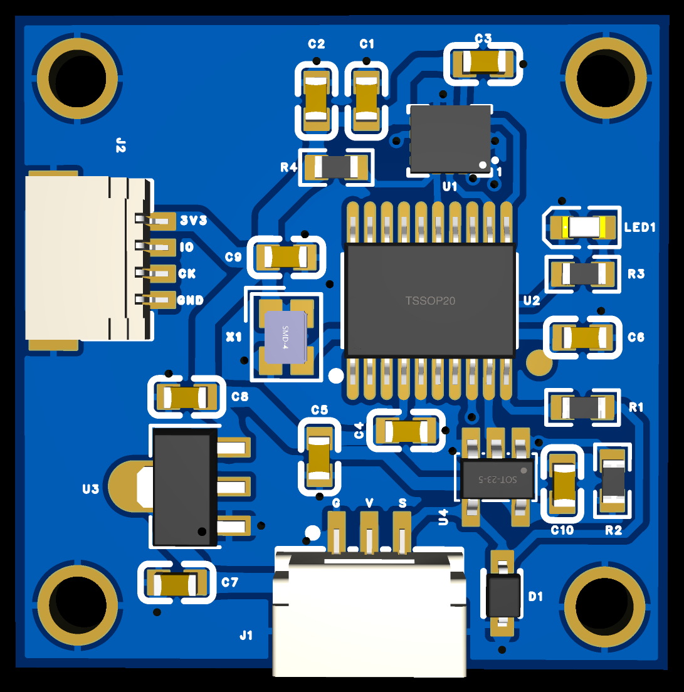
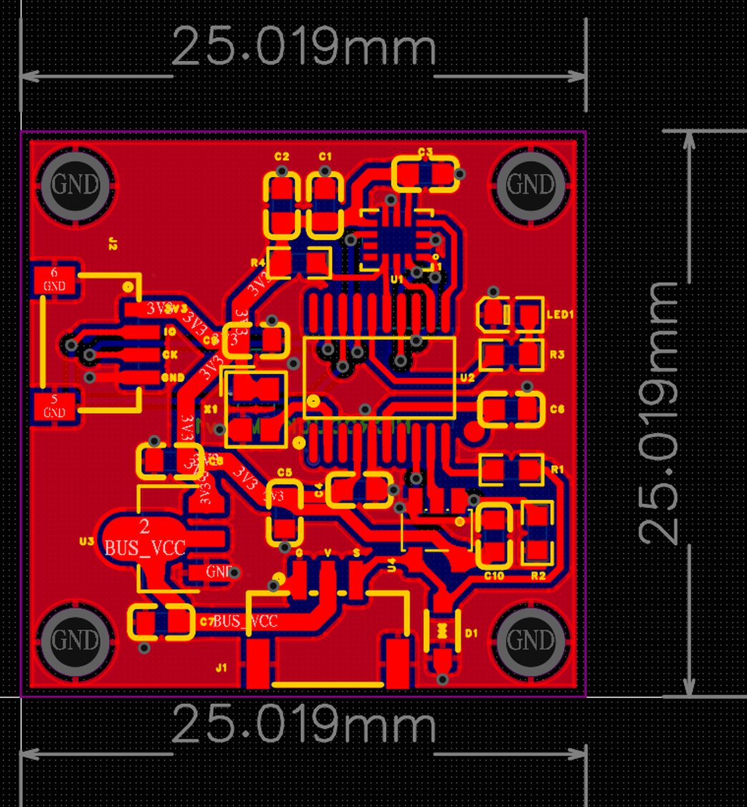

# imu_to_dxl · 25 × 25 mm 版 · 求评审

> ⚠️ **这是第三方复刻件，不是官方设计，且未经打样、未经实物验证。**
> 官方从未公开这块板的原理图、Gerber 或外形。本目录是根据 MJCF 模型、官方运行时源码
> 和公开数据手册反推 + 自行选型的结果。
> 发现问题请开 [issue](https://github.com/fanhao375/microduck-replica/issues)。

| 3D 视图 | 顶层布线 |
|---|---|
|  |  |

*左：3D 视图，J2（SWD，左）与 J1（总线，下）都是侧插，插拔方向朝板外；四角金色环是金属化 M2 孔。
右：顶层铜箔与铺铜，红色为顶层、蓝色为底层。*

| 文件 | 说明 |
|---|---|
| [`imu_to_dxl_pcb_3d.png`](imu_to_dxl_pcb_3d.png) | 3D 视图 |
| [`imu_to_dxl-原理图.pdf`](imu_to_dxl-原理图.pdf) | 矢量 PDF |
| [`imu_to_dxl-PCB.pdf`](imu_to_dxl-PCB.pdf) | 各层装配图 |
| [`imu_to_dxl-接线表.md`](imu_to_dxl-接线表.md) | 逐网络列出每个引脚，由网表脚本生成 |
| [`imu_to_dxl-Gerber.zip`](imu_to_dxl-Gerber.zip) | 生产文件，13 个层 + 钻孔，可直接下单 |
| [`imu_to_dxl-BOM.xlsx`](imu_to_dxl-BOM.xlsx) · [`imu_to_dxl-贴片坐标.xlsx`](imu_to_dxl-贴片坐标.xlsx) | 嘉立创贴片用 |
| [`imu_to_dxl-PCB.step`](imu_to_dxl-PCB.step) | 3D 模型，用于整机装配核对 |

---

## 与本仓库现有 45 × 22 版的关系

**这是另一条设计线，不是那版的增量改进。** 两版针对的总线协议就不同，
零件不能互换，请当作两个并列方案评估。

| | 现有 45 × 22 版 | 本版 25 × 25 |
|---|---|---|
| 总线协议 | Dynamixel（ID 200） | **飞特 STS/SCS** |
| 板框 | 45 × 22 mm = 990 mm²，R2 圆角 | **25 × 25 mm = 625 mm²**（面积小 37%），直角 |
| 安装孔 | 2 × M2 非金属化 φ2.2，对角 | **4 × M2 金属化 φ2.2 + φ3.0 GND 焊环**，孔距 20.17 mm |
| 总线接口 | J1 / J2 双口，可串在链中段 | J1 单口 GH 1.25 侧插 —— **只能挂链尾** |
| 调试口 | J3 6P，含 UART printf | J2 4P SH 1.00 侧插，仅 SWD |
| 铺铜 | 底层整片 GND，顶层不铺 | **双面 GND** |
| 贴装 | — | **23 个器件全在顶层**，单面贴装 |
| 走线 | 195 段 / 333.6 mm，底层 19 段 | 169 段 / 219 mm，底层 18 段（**占 19.6%**） |
| 过孔 | 34 × φ0.6 / 孔 0.3 | 32 × φ0.56 / 孔 0.3 |

方向不同的几处，理由分别是：

- **单口 vs 双口**：本版把 IMU 板定位成菊花链**末端设备**，省掉直通干线的载流要求，
  换来板面缩小。代价是它必须挂在链尾，中途插不进去。
- **直角 vs 圆角**：做过圆角版，后来因为板小、四角本来就有 M2 孔，圆角带来的抗崩边收益有限，
  而立创 EDA 的圆弧图元在 API 下不可靠（建出来渲染正常但不落盘、不进 Gerber），改回直角。
- **4 孔 vs 2 孔**：四角固定 + 金属化 GND 焊环，抗拧紧力矩，同时四角自带平面缝合、螺丝接地。

---

## 这块板干什么

15 个舵机挂在一条半双工总线上。这块小板作为**第 16 个设备**挂在同一条总线上，
对外表现成一个飞特从机，主控用读寄存器的方式向它要姿态数据。

IMU 用 **LSM6DSV16X**，片内有 SFLP 硬件融合块，直接输出游戏旋转四元数 ——
姿态解算不占主控算力，也不占总线带宽。

```
主控 ──┬─ 舵机 ×15
       └─ imu_to_dxl（本板，链尾）
```

收发方向由 **USART2_DE（PA1）硬件控制**：外设在发送期间自动拉高 `BUS_TXEN`，
前后沿由 DEAT/DEDT 设定，固件不用手动切收发。

---

## 关键参数

| 项 | 值 |
|---|---|
| 板框 | 25.0 × 25.0 mm，2 层（Gerber 实测 24.9936 × 24.9936，0 条圆弧） |
| 供电 | BUS_VCC → HT7333-A → 3.3 V |
| 线宽 | 最小 **10 mil**；信号 10–12、GND 16、3V3 20、BUS_VCC 30 |
| 钻孔 | 过孔全部 0.30 mm；M2 孔 2.20 mm |
| 离板边最近的铜 | 0.348 mm（J1 固定金具） |
| 去耦距离 | U4 1.63 mm / U1 2.00 mm / U2 2.17 mm，均在 3 mm 内 |
| LDO 到 IMU | **16.4 mm**，对角布置 |
| MCU 到 IMU | 6.1 mm |

**热源与 IMU 对角分开**：U3（LDO）在左下，U1（IMU）在右上，相距 16.4 mm。
LDO 是板上唯一有意义的热源，IMU 是零偏最吃温度的器件。

---

## 复查结果

EasyEDA 自带 DRC，以及一套独立写的几何复核脚本，两套都跑过：

| 检查 | 结果 |
|---|---|
| EasyEDA DRC | **0 项** |
| 间距（独立按规则重算：走线 4 / 焊盘 6 / 过孔 6 / 孔孔 11.8 / 板边 6 mil） | 全部满足 |
| 网络连通 | 18 个非 GND 网络**全部单一连通** |
| 虚接排查 | 对每个网络找「桥」（去掉即断开的接点），**最薄 10.00 mil**，且都是同宽走线满宽对接 |
| 拐角 | 6 段非 45° 倍数（91.6° / −92.0° / −87.3° / 88.5° / −3.6° / −52.3°），10 mil 线在现代工艺上无实害 |

---

## 想请重点看这几处

### 1. BUS_TXEN 的下拉（R2 10 kΩ）

SN74LVC1G126 的 `OE` 高有效。PA1 在复位期间是 Hi-Z，缓冲器的 OE 会浮空，
可能自己使能去驱动总线，和链上其他设备打架 —— 而且每次上电、每次复位都会发生一遍。

TI 手册 ZHDS370S §5.3 建议运行条件脚注明文要求「所有未使用的输入引脚必须保持连接至
V_CC 或 GND」；§5.5 给出输入停在中间电平时 ΔI_CC 最大 **500 µA**，是正常 I_CC（10 µA）的 50 倍。

取值核算：I_I 最大 ±5 µA × 10 kΩ = **50 mV**，V_IL 上限 0.8 V，余量 16 倍。
唯一擦边的是 §5.3 的 Δt/Δv ≤ 10 ns/V：PA1 撒手瞬间，10 kΩ 要放掉 C_i = 4 pF 加走线电容，
τ ≈ 50 ns，折合 28 ns/V、超标 2.8 倍。但这次穿越是单调的、一次性的、且朝安全方向
（使能 → 禁用），最坏是一个短于 100 ns 的毛刺，只有 1 Mbps 一个位时间的十分之一。
上电时 PA1 一开始就是 Hi-Z，下拉从 V_CC 爬升起就把 OE 摁在 0，根本没有慢边沿。

### 2. C6（NRST 电容）离 NRST 脚 5.0 mm

按 5 mil 网格把整板搜过：只挪 C6 最多做到 4.14 mm，为 0.9 mm 重新布线不划算；
做到 2.18 mm 需要挤走 C4，而 C4 是 MCU 的 VDD 去耦，必须贴着 pin 4。

风险是 15 个舵机开关几安培时的噪声引起误复位。**这是上电后第一件要实测的事。**

### 3. IMU 离板心 8.7 mm

陀螺不受影响（刚体上角速度处处相同）；加速度计有杠杆臂项 ω×(ω×r) + α×r，
按行走时 ω ≈ 3 rad/s、α ≈ 20 rad/s² 算约 0.26 m/s²，合 2.6% g。

对主要吃重力方向和角速度的策略可以忽略，但**这个偏移要写进 MJCF 的 IMU site**，
否则 sim-to-real 会留一个固定偏差。

### 4. 底层 43 mm 走线里 SWD 占 25.7 mm

SWDIO 和 SWCLK 各有近 10 mm 的横线，把底层地平面横向切开。
SWD 运行期静止，但缝影响的是**别人的回流**。顶层已排满，这是本版最大的电气妥协。
缓解措施是 19 个 GND 缝合过孔。

### 5. X1 / C9 是 DNP，却占约 17 mm²（板面 2.7%）

TSSOP-20 封装没有 OSC_OUT，无源晶体用不了，只能走有源振荡器经 PC14 旁路。
默认时钟是 HSI16（±1%），1 Mbps UART 容忍 ±3%，余量三倍。
留焊盘是为台架真出帧错误时的后路 —— 改板比留焊盘贵得多。

---

## 已确认 / 未验证

**逐条查过数据手册的：** STM32G030x6 DS12991 Rev 3（Table 9 USART 实现、Table 12/13 引脚与 AF
映射、Table 18/21 FT 脚电压极限、Table 38 HSI16 精度）；SN74LVC1G126 ZHDS370S（§3 OE 极性、
§4 DBV 脚序、§5.3 建议运行条件、§5.5 电气特性）；Holtek HT73XX Rev1.30。

**完全未验证：** 板子从未打样、从未上电；固件一行没写；
LSM6DSV16X 的 SPI 时序与中断配置未验证；总线时序、ID 冲突、菊花链拓扑全是纸上推演。

## 待办

- [ ] 打样 5 片，先验 LDO 出 3.3 V、SWD 能连上、LED 会闪
- [ ] 验 SPI 读 IMU
- [ ] 接总线，重点盯误复位（对应上面第 2 条）和帧错误（对应第 5 条）
- [ ] 补 `.eprj2` 工程文件（需从嘉立创 EDA 界面导出，API 导不了）
